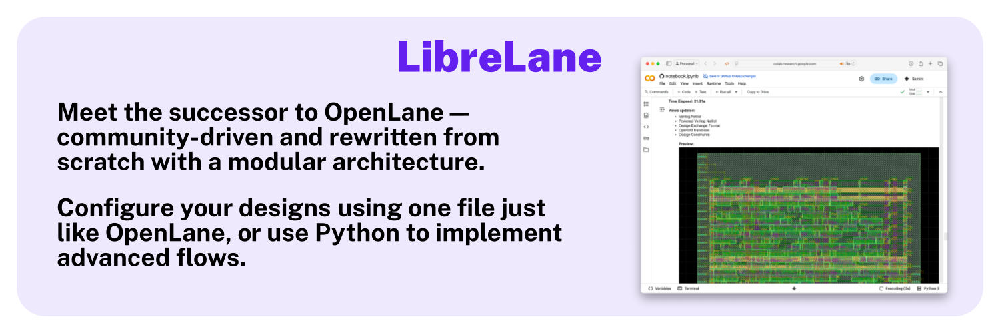

<h3 align="center"> OpenLane is currently in maintenance mode.</h3>

The versions of OpenLane currently being offered and supported are currently
versions 1.0.X, as they were used for countless tape outs for the Google MPW and
Efabless chipIgnite shuttles. Only critical bugfixes will be merged at this
point. The intent is that tape-outs on older shuttles may be reproduced.
**OpenLane is not recommended for new projects or designs.**

For new designs, kindly check out the successor to the OpenLane flow, the
LibreLane flow infrastructure (which is backwards-compatible.)

<p align="center">
    <a href="https://github.com/librelane/librelane"></a>
</p>

---

<h1 align="center">OpenLane</h1>
<p align="center">
    <a href="https://opensource.org/licenses/Apache-2.0"></a>
    
    <a href="https://openlane.readthedocs.io/"></a>
    <a href="https://matrix.to/#/#openlane:fossi-chat.org"></a>
</p>

OpenLane is an automated RTL to GDSII flow based on several components including OpenROAD, Yosys, Magic, Netgen, CVC, SPEF-Extractor, KLayout and a number of custom scripts for design exploration and optimization. The flow performs all ASIC implementation steps from RTL all the way down to GDSII.

You can check out the documentation, including in-depth guides and reference manuals at [ReadTheDocs](https://openlane.readthedocs.io/).

## Installation, the short version
The short version is, to install the OpenLane environment...

> On Windows, install and launch the [Windows Subsystem for Linux](https://docs.microsoft.com/en-us/windows/wsl/install) before doing anything. We recommend and provide instructions for Ubuntu 20.04.

> On macOS, get [brew](https://brew.sh).

1. [Get Docker](https://docs.docker.com/get-docker/) (or a compatible container engine)
    * On Ubuntu, follow the [Docker post install instructions](https://docs.docker.com/engine/install/linux-postinstall/) after you install Docker.
2. Get Python 3.6 or higher: ([macOS](https://formulae.brew.sh/formula/python3) | [Ubuntu](https://packages.ubuntu.com/focal/python3))
    * On Ubuntu, you may also need to install venv: `apt-get install python3-venv`, and pip: `apt-get install python3-pip`.
3. Get git ([macOS](https://formulae.brew.sh/formula/git) | [Ubuntu](https://packages.ubuntu.com/focal/git))
4. Get GNU Make ([macOS](https://formulae.brew.sh/formula/make) | [Ubuntu](https://packages.ubuntu.com/focal/make))


Run the following commands in your command-line prompt:

```sh
cd $HOME
git clone https://github.com/The-OpenROAD-Project/OpenLane
cd OpenLane
make
make test
```

If everything's gone smoothly, that's it. OpenLane is set up on your computer. To enter the OpenLane environment, `cd $HOME/OpenLane` and then `make mount`.

## Installation, the long version
See the installation docs at https://openlane.readthedocs.io/en/superstable/getting_started/installation/index.html.

## Usage
After entering the OpenLane environment, you can start hardening chips: the following command, for example, runs the included [spm design](./designs/spm).

```sh
./flow.tcl -design spm
```

## Publication
If you use OpenLane in your research, please cite the following paper.

* M. Shalan and T. Edwards, “Building OpenLANE: A 130nm OpenROAD-based Tapeout-Proven Flow: Invited Paper,” *2020 IEEE/ACM International Conference On Computer Aided Design (ICCAD)*, San Diego, CA, USA, 2020, pp. 1-6. [Paper](https://ieeexplore.ieee.org/document/9256623)

```bibtex
@INPROCEEDINGS{9256623,
  author={Shalan, Mohamed and Edwards, Tim},
  booktitle={2020 IEEE/ACM International Conference On Computer Aided Design (ICCAD)}, 
  title={Building OpenLANE: A 130nm OpenROAD-based Tapeout- Proven Flow : Invited Paper}, 
  year={2020},
  volume={},
  number={},
  pages={1-6},
  doi={}}
```


## Legal Stuff

OpenLane is ©2020-2024 Efabless Corporation and is available under
[the Apache License, version 2.0](https://www.apache.org/licenses/LICENSE-2.0.txt).

Newer container images (downloaded from
`ghcr.io/the-openroad-project/openlane`) are distributed by Somnium Consulting
LLC under the same license.

Older container images (downloaded from `docker.io/efabless/openlane`) were
distributed by Efabless Corporation under the same license.

Binaries in OpenLane distributions may fall under stricter open source licenses.
