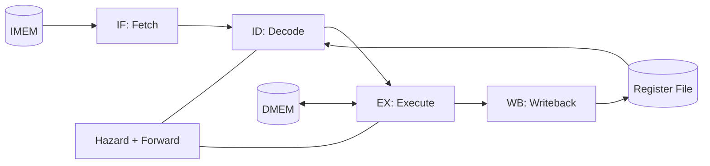

# Tritone — A Balanced Ternary CMOS Processor  
**“60× density efficiency for the post‑Moore era”** *(research prototype)*

<div align="center">


</div>

Tritone is a proof‑of‑concept **27‑trit balanced ternary RISC processor** plus a supporting ecosystem: a verified **ternary standard‑cell library (GT‑LOGIC)**, synthesizable **SystemVerilog RTL**, a **BTISA assembler/toolchain**, tests, and optional FPGA + physical‑design flows.

> “Perhaps the prettiest number system of all is the balanced ternary notation.”  
> — Donald Knuth, *The Art of Computer Programming*

---

## ✨ At a glance
- **Balanced ternary** digits: **{ −1, 0, +1 }**  
- **Word size**: **27 trits** (≈ **42.8** binary bits of information)
- **Pipeline**: **4‑stage** in‑order (IF → ID → EX → WB) with hazard detection + forwarding (single load‑use stall)
- **Fetch geometry**: **5‑trit PC** → **3⁵ = 243** instruction words (IMEM modeled as combinational logic in the ASAP7 study)
- **ISA**: **BTISA**, 9‑trit fixed‑length instructions (**~27** mnemonics; `MUL` is currently experimental/iterative)
- **Cell library**: **GT‑LOGIC** (validated SPICE cells; includes BTFA, inverters, min/max, mux, etc.)
- **EDA‑friendly methodology**: **“Virtual Binary”** 2‑bit encoding per trit for synthesis flows

---

## 📚 Table of Contents
- [Why balanced ternary?](#-why-balanced-ternary)
- [Reported implementation metrics (paper / article)](#-reported-implementation-metrics-paper--article)
- [How Tritone represents a trit (“Virtual Binary”)](#-how-tritone-represents-a-trit-virtual-binary)
- [Architecture](#-architecture)
- [Repository structure](#-repository-structure)
- [Quick start](#-quick-start)
- [GT‑LOGIC cell library](#-gt-logic-cell-library)
- [BTISA instruction set](#-btisa-instruction-set)
- [Synthesis + FPGA notes](#-synthesis--fpga-notes)
- [Physical design flow (OpenROAD / ASAP7)](#-physical-design-flow-openroad--asap7)
- [Roadmap](#-roadmap)
- [Citing Tritone](#-citing-tritone)
- [License](#-license)
- [Acknowledgments](#-acknowledgments)

---

## 🧠 Why balanced ternary?
Balanced ternary uses trits **{ −1, 0, +1 }** (often written **{ −, 0, + }**) instead of bits.

Why it matters in modern VLSI (especially in an “interconnect‑limited” era):

- **Radix economy:** minimizing hardware cost per numeric range favors base **e ≈ 2.718**; among integer bases, **3 is optimal**.
- **Fewer wires for the same information:** each trit carries **log₂(3) ≈ 1.585 bits**. A 32‑bit payload needs **⌈32 / 1.585⌉ = 21** trits → **~37% fewer interconnects**.
- **Signed symmetry “for free”:** the sign is inherent; **negation is tritwise inversion** (+↔−, 0→0).
- **Nice numeric properties:** truncation behaves like “round‑to‑nearest” more often than in binary, which is attractive for fixed‑point DSP and quantized ML.
- **AI‑friendly representation:** many compressed models use weights in **{−1, 0, +1}** (ternary weight networks). A balanced‑ternary datapath can represent and operate on these values natively.

<details>
<summary><strong>Where the “60×” density intuition comes from</strong></summary>

For a **fixed wire count**, ternary explodes the state space faster than binary.  
Example: a **10‑wire** bus carries **3¹⁰ = 59,049** ternary states vs **2¹⁰ = 1,024** binary states → **59,049 / 1,024 ≈ 57.6 ≈ 60×**.

</details>

---

## 📊 Reported implementation metrics (paper / article)
The accompanying write‑up reports full‑core **RTL‑to‑GDS** results in the **ASAP7** predictive 7nm FinFET PDK using the GT‑LOGIC library and a Virtual‑Binary mapping flow.

### Headline PPA (reported)

| Metric | Reported value | Notes |
|---|---:|---|
| Technology | ASAP7 (predictive 7nm FinFET) | research PDK (often license‑restricted) |
| Active cell area | **39 µm²** | logic only (cell area) |
| Core utilization | **~31%** | implies ~124 µm² core footprint incl. whitespace/fillers |
| Instance count | **~471 cells** | GT‑LOGIC stdcells |
| Critical path delay | **1.626 ns** | ≈ **615 MHz** (carry chain dominates) |
| Dynamic power | **0.967 mW** | “typical” estimate |
| Leakage power | **0.37 µW** | estimate |
| Routed wirelength | **~0.7 mm** | conservative (dual‑rail routing in current flow) |

### Interpreting “60× density”

The write‑up **validates** that *as stated*, “60×” is best understood as a **fixed‑bus‑width** intuition (e.g., 10‑wire ternary vs 10‑wire binary is ~57.6× more states). For the full core, the same write‑up contextualizes:

- **Area reduction vs Ibex (32‑bit RISC‑V)**: ~**7.7× to 11.5×** smaller (39 µm² vs ~300–450 µm² estimates).
- **Bit‑equivalent density (conservative)**: ~**11×** higher bits/µm² (≈42.8 “effective bits” / 39 µm² vs 32 / 300 µm²).

> Reproducibility note: RTL + tests + SPICE cell validation are open‑flow friendly; reproducing the **7nm** numbers typically requires **ASAP7** access. Also note ASAP7 is *predictive* (research PDK), not a foundry tape‑out.

---

## 🔁 How Tritone represents a trit (“Virtual Binary”)
To keep the RTL *and* mainstream EDA tools happy, Tritone represents each trit using **two binary wires** during synthesis (“Virtual Binary”):

| Trit | Encoded bits | Physical target |
|---:|:---:|:---|
| −1 | `00` | ~0V |
| 0  | `01` | ~0.9V (VDD/2) |
| +1 | `10` | ~1.8V (VDD) |
| illegal / unused | `11` | — |

This lets you write synthesizable SystemVerilog, run standard simulators, and pass through Boolean‑only synthesis and P&R. The “ternary‑ness” is re‑introduced during tech‑mapping via **GT‑LOGIC** cells, which interpret these dual‑rail controls and drive **a single 3‑level physical node** for dense arithmetic and datapaths.

---

## 🏛 Architecture
### System block diagram (pipeline view)

```text
┌─────────────────────────────────────────────────────────────────────┐
│                    BALANCED TERNARY CPU SYSTEM                       │
├─────────────────────────────────────────────────────────────────────┤
│  ┌─────────┐    ┌─────────┐    ┌─────────┐    ┌─────────┐          │
│  │   IF    │───▶│   ID    │───▶│   EX    │───▶│   WB    │          │
│  │  Fetch  │    │ Decode  │    │ Execute │    │ Write   │          │
│  └────┬────┘    └────┬────┘    └────┬────┘    └────┬────┘          │
│       │              │              │              │                 │
│       │         ┌────┴────┐        │              │                 │
│       │         │ Register│◀───────┴──────────────┘                 │
│       │         │  File   │    (forwarding + hazards)                │
│       │         └────┬────┘                                          │
│  ┌────┴────┐   ┌────┴────┐   ┌─────────┐   ┌─────────┐             │
│  │  IMEM   │   │ Hazard  │   │   ALU   │   │  DMEM   │             │
│  │ 243×9t  │   │ + Fwd   │   │  ops    │   │ 729×27t │             │
│  └─────────┘   └─────────┘   └─────────┘   └─────────┘             │
└─────────────────────────────────────────────────────────────────────┘
```

### (Optional) Mermaid view

> GitHub renders Mermaid diagrams automatically.



---

## 🗂 Repository structure
> Depending on which branch/version you’re looking at, directory names may vary slightly. The “complete” layout below matches the full RTL + SPICE + tooling tree.

```text
tritone-complete/
├── hdl/                          # SystemVerilog RTL + testbenches
│   ├── rtl/                      # Synthesizable modules
│   ├── tb/                       # Testbenches
│   └── sim/                      # Simulation scripts
│
├── spice/                        # Transistor-level ternary cells + testbenches
├── asic/                         # Liberty (.lib) timing models, etc.
│   └── lib/gt_logic_ternary.lib
│
├── tools/                        # Assembler + scripts + synthesis helpers
├── tests/                        # Python tests (unit + integration)
├── docs/                         # ISA + cell specs + papers + slides
└── eda playground/               # Experiments / logs (name includes a space)
```

---

## 🚀 Quick start
### Prerequisites

| Tool | Version | Purpose |
|------|---------|---------|
| Python | 3.8+ | assembler + tests |
| Icarus Verilog | 12.0+ | RTL simulation |
| ngspice | 42+ | SPICE simulation |
| Node.js | 18+ | presentation generator (optional) |

### 1) Run CPU simulation

```bash
cd hdl/sim
./run_cpu_sim.bat          # Windows
./run_sim.sh               # Linux/macOS
```

Manual Icarus flow:

```bash
cd hdl
iverilog -g2012 -o tb_cpu.vvp \
  rtl/ternary_pkg.sv \
  rtl/btfa.sv \
  rtl/ternary_adder.sv \
  rtl/ternary_alu.sv \
  rtl/ternary_regfile.sv \
  rtl/btisa_decoder.sv \
  rtl/ternary_hazard_unit.sv \
  rtl/ternary_forward_unit.sv \
  rtl/ternary_memory.sv \
  rtl/ternary_cpu.sv \
  rtl/ternary_cpu_system.sv \
  tb/tb_ternary_cpu.sv

vvp tb_cpu.vvp
```

### 2) Assemble a BTISA program

```bash
cd tools
python btisa_assembler.py programs/test_arithmetic.btasm -o output.mem
```

### 3) Run SPICE simulations (cells)

```bash
cd spice
ngspice testbenches/tb_btfa_cin0_dc.spice
```

### 4) Run Python tests

```bash
pytest tests/ -v
```

---

## 🧩 GT‑LOGIC cell library
GT‑LOGIC is the project’s reusable ternary logic library, validated with SPICE and used as the target for Virtual‑Binary tech‑mapping.

### Highlights

- **Inverters / thresholds:** STI / PTI / NTI  
- **Logic:** TMIN/TMAX (ternary AND/OR analogs), TNAND/TNOR  
- **Arithmetic:** BTHA, **BTFA** (balanced ternary adders)  
- **Control:** TMUX3 (3:1 ternary mux), plus helper primitives

### Device concept (T‑CMOS / BTBT) — why a “0” level can be stable

Tritone’s write‑up models a **T‑CMOS** mechanism where the intermediate level is stabilized by **band‑to‑band tunneling (BTBT)** currents: at input **0.9V**, NMOS/PMOS drift currents are largely sub‑threshold, but engineered BTBT/subthreshold leakages balance at **~VDD/2**, creating an equilibrium output around **0.9V**. Drive strength in the (0) state is lower than rail states but sufficient for local interconnects.

**Manufacturability note (as described):** the ternary behavior is induced via **doping modulation**, potentially requiring a single extra **“T‑implant” mask** but no exotic materials.

**PVT robustness (as reported):** logic remains functional if the intermediate level stays within roughly **0.7V–1.1V**.

<details>
<summary><strong>BTFA definition</strong></summary>

A 1‑trit full adder sums two trits and a carry‑in:

- `Sum = (A + B + Cin) mod 3`
- `Cout = (A + B + Cin) div 3`

The BTFA spans **27** input combinations (3³). The write‑up cites a compact transistor implementation and uses BTFA chains as the basis of Tritone’s 27‑trit ripple adder.

</details>

---

## 🧾 BTISA instruction set
### Overview

- **Word size**: 27 trits (≈ 42.8 bits equivalent)
- **Registers**: 9 GPRs (R0–R8), with R0 hardwired to zero
- **Memory model**: 243 instruction words, 729 data words
- **Encoding**: 9 trits per instruction

### Instruction encoding (conceptual)

```text
[8:6] Opcode  (3 trits = 27 opcodes possible)
[5:4] Rd      (2 trits = 9 registers)
[3:2] Rs1     (2 trits = 9 registers)
[1:0] Rs2/Imm (2 trits = 9 values or register)
```


### Assembler conveniences

The Python assembler supports several **pseudo‑instructions** that expand into one or more real BTISA instructions, including:

`LDI`, `MOV`, `JMP`, `RET`, `BEQZ`, `BNEZ`


<details>
<summary><strong>Complete instruction set (26 mnemonics)</strong></summary>

#### Arithmetic
| Mnemonic | Operation | Description |
|----------|-----------|-------------|
| `ADD` | Rd = Rs1 + Rs2 | Ternary addition |
| `SUB` | Rd = Rs1 − Rs2 | Implemented as ADD with operand negated (STI) |
| `NEG` | Rd = −Rs1 | Negate (flip trits) |
| `MUL` | Rd = Rs1 × Rs2 | Experimental (iterative, area‑oriented) |
| `SHL` | Rd = Rs1 << 1 | Shift left (×3) |
| `SHR` | Rd = Rs1 >> 1 | Shift right (÷3) |
| `ADDI` | Rd = Rs1 + Imm | Add immediate |

#### Logic
| Mnemonic | Operation | Description |
|----------|-----------|-------------|
| `MIN` | Rd = MIN(Rs1, Rs2) | Tritwise minimum (AND) |
| `MAX` | Rd = MAX(Rs1, Rs2) | Tritwise maximum (OR) |
| `XOR` | Rd = Rs1 XOR Rs2 | Ternary XOR (mod‑3 add) |
| `INV` | Rd = STI(Rs1) | Standard ternary invert |
| `PTI` | Rd = PTI(Rs1) | Positive threshold invert |
| `NTI` | Rd = NTI(Rs1) | Negative threshold invert |

#### Memory
| Mnemonic | Operation | Description |
|----------|-----------|-------------|
| `LD` | Rd = MEM[Rs1+Imm] | Load word |
| `ST` | MEM[Rs1+Imm] = Rs2 | Store word |
| `LDT` | Rd = MEM[Rs1] | Load direct |
| `STT` | MEM[Rs1] = Rs2 | Store direct |
| `LUI` | Rd = Imm << 6 | Load upper immediate |

#### Control flow
| Mnemonic | Operation | Description |
|----------|-----------|-------------|
| `BEQ` | if Rs1=Rs2: PC += Imm | Branch if equal |
| `BNE` | if Rs1≠Rs2: PC += Imm | Branch if not equal |
| `BLT` | if Rs1<Rs2: PC += Imm | Branch if less than |
| `JAL` | Rd = PC+1; PC = Rs1+Imm | Jump and link |
| `JALR` | Rd = PC+1; PC = Rs1 | Jump and link register |
| `JR` | PC = Rs1 | Jump register (return) |

#### System
| Mnemonic | Operation | Description |
|----------|-----------|-------------|
| `NOP` | — | No operation |
| `HALT` | — | Halt execution |
| `ECALL` | — | Environment call |

</details>

### Example program (uses assembler pseudo‑instruction `LDI`)

```asm
# Compute sum of 1 + 2 + 3 = 6
    LDI  R1, 1        # R1 = 1
    LDI  R2, 2        # R2 = 2
    LDI  R3, 3        # R3 = 3
    ADD  R4, R1, R2   # R4 = 1 + 2 = 3
    ADD  R5, R4, R3   # R5 = 3 + 3 = 6
    HALT
```

---

## 🧪 Synthesis + FPGA notes
<details>
<summary><strong>Yosys synthesis summary (from EDA Playground)</strong></summary>

| Resource | Count |
|----------|------:|
| Flip‑Flops (FDCE) | 164 |
| LUTs (total) | 194 |
| Inverters | 246 |
| Multiplexers | 81 |
| I/O Buffers | 128 |
| **Total Cells** | **814** |

</details>

### FPGA implementation (multi‑vendor)

| Vendor | Constraint file | Build script |
|--------|-----------------|--------------|
| Xilinx | `ternary_alu.xdc` | `build.tcl` |
| Lattice | `ternary_alu_lattice.lpf` | `build_lattice.tcl` |
| Intel/Altera | `ternary_alu_quartus.sdc` | `build_quartus.tcl` |

**Timing note:** the critical path is usually the **27‑trit ripple‑carry adder**; v1 estimates **~25–40 MHz** Fmax for a conservative Artix‑7 projection (50 MHz target).

---

## 🏗 Physical design flow (OpenROAD / ASAP7)
This portion is research‑oriented and intended to reproduce the reported physical metrics in **ASAP7**.

### High‑level flow

1. **RTL (SystemVerilog)** using **Virtual Binary** (2 wires per trit)
2. **Synthesis (Yosys)** → generic Boolean netlist
3. **Custom tech‑mapping** → map recognized patterns to **GT‑LOGIC** cell instances (e.g., `TMIN_X1`, `TMAX_X1`, BTFA, etc.)
4. **OpenROAD** automated flow:
   - Floorplan (TritonFPlan)
   - Placement (RePlAce)
   - Routing (TritonRoute)
   - Timing signoff (OpenSTA)

### Important implementation detail: routing today is conservative

In the reported OpenROAD flow, each ternary signal is treated as **two routed binary nets** (dual‑rail). A true “single‑wire, 3‑level” ternary router would *merge* these pairs. The write‑up notes this makes reported routing metrics conservative (e.g., the ~0.7 mm wirelength figure), and estimates merging could reduce wirelength by **~37%**.

### Requirements

- OpenROAD
- Yosys
- ASAP7 PDK (often requires academic license)

> If your repo includes `synthesis/` and OpenROAD scripts, start there; otherwise, see `docs/` for flow notes.

---

## 🛣 Roadmap
- [x] GT‑LOGIC cell library + SPICE validation
- [x] 27‑trit CPU RTL (4‑stage pipeline) with hazards + forwarding
- [x] BTISA assembler + example programs
- [x] Test suite (unit + integration)
- [ ] Expand ISA/program coverage + CI
- [ ] Higher‑performance adders (carry‑lookahead / prefix)
- [ ] Memory hierarchy experiments
- [ ] Broader physical‑design scripts + reproducibility docs

---

## 📝 Citing Tritone
If you use Tritone in academic work, please cite the associated paper (update fields as appropriate):

```bibtex
@article{tritone2025,
  title   = {Tritone: A Balanced Ternary CMOS Processor Architecture for the Post-Moore Era},
  author  = {Your Name and Co-Authors},
  journal = {IEEE Transactions on [Journal Name]},
  year    = {2025},
  note    = {Under Review}
}
```

---

## 📄 License
MIT License. See `LICENSE`.

---

## 🙏 Acknowledgments
- OpenROAD and the open EDA community
- ngspice, Yosys, Icarus Verilog / Verilator, pytest (+ cocotb where used)
- SKY130 open PDK ecosystem
- ASAP7 PDK authors/providers (research use)
