# Tritone — A Balanced Ternary CMOS Processor
**A 27‑trit balanced‑ternary CPU, custom ternary standard‑cell library (GT‑LOGIC), toolchain, and ASIC tapeout flow.**

[](LICENSE)
[]()
[]()
[]()
[]()

> “Perhaps the prettiest number system of all is the balanced ternary notation.”  
> — Donald Knuth, *The Art of Computer Programming*

---

## ✨ Highlights

- **Balanced ternary** digits **{−1, 0, +1}**, with **27 trits ≈ 42.8 effective bits** of information.
- **4‑stage in‑order pipeline** (IF/ID/EX/WB) with hazard detection + forwarding.
- **GT‑LOGIC ternary cells** validated at transistor level (SPICE) and used in higher‑level compositions.
- **ASIC status:** **300 MHz @ SKY130 (1.8V, 25°C typical) — signoff clean** (DRC/LVS/Antenna/Fanout/Slew/Cap).  
- **Research PPA (7nm ASAP7/OpenROAD, reported):** **39 µm² active cell area**, **1.626 ns** critical path (**615 MHz**), ~**0.967 mW** dynamic power.

---

## 📚 Table of Contents

- [Why balanced ternary?](#-why-balanced-ternary)
- [Results](#-results)
  - [SKY130 ASIC results (tapeout-ready)](#sky130-asic-results-tapeout-ready)
  - [Reported 7nm results (ASAP7 + OpenROAD)](#reported-7nm-results-asap7--openroad)
  - [Tritone vs Ibex (context)](#tritone-vs-ibex-context)
- [Architecture overview](#-architecture-overview)
- [How Tritone represents a trit (“Virtual Binary”)](#-how-tritone-represents-a-trit-virtual-binary)
- [Repo layout](#-repo-layout)
- [Quick start](#-quick-start)
- [Instruction set (BTISA)](#-instruction-set-btisa)
- [Verification](#-verification)
- [ASIC/tapeout notes (Caravel)](#-asictapeout-notes-caravel)
- [Cite](#-cite)
- [License](#-license)

---

## 🧠 Why balanced ternary?

A ternary wire carries **log₂(3) ≈ 1.585 bits** of information. For a fixed payload, ternary can reduce global wire count:
- 32 “binary bits” can be carried with **ceil(32 / 1.585) = 21 ternary wires**, a **~37% reduction** in wire count.

Balanced ternary is also naturally *signed*: the MS trit acts like a sign with symmetry around zero, making operations like negation and comparison elegant.

---

## 📊 Results

### SKY130 ASIC results (tapeout-ready)

**Current status: 300 MHz @ SKY130 — PASS (no signoff violations).**  
Power numbers are from signoff reports (`signoff/*_sta.power.rpt`) at **typical corner @ 25°C, 1.8V** and scale roughly with frequency (dynamic power dominates).

#### Summary table

| Run | Freq | Critical Path | Setup Slack | Power | Area | Status |
|---|---:|---:|---:|---:|---:|:---:|
| tritone_v4 (baseline) | 50 MHz | 0.32 ns | 16.68 ns | 85.7 µW | 0.64 mm² | PASS |
| tritone_v5_area | 50 MHz | 1.20 ns | 14.55 ns | 194 µW | 0.16 mm² | PASS |
| tritone_v5_power | 50 MHz | 1.19 ns | 14.56 ns | 182 µW | 0.16 mm² | PASS |
| tritone_v5_100mhz | 100 MHz | 1.21 ns | 6.54 ns | 361 µW | 0.16 mm² | PASS |
| tritone_v6_200mhz | 200 MHz | 1.27 ns | 2.48 ns | 636 µW | 0.16 mm² | PASS |
| **tritone_v6_300mhz** | **300 MHz** | **1.32 ns** | **1.09 ns** | **966 µW** | **0.16 mm²** | **PASS** |

#### Charts

> GitHub supports Mermaid diagrams. If your renderer doesn’t, these will appear as code blocks.


#### Key achievements (SKY130)

- **6× frequency improvement**: 50 MHz → 300 MHz  
- **75% area reduction**: 0.64 mm² → 0.16 mm²  
- **Zero violations** at 300 MHz (DRC/LVS/Antenna/Fanout/Slew/Cap)  
- **~33% timing margin** remaining: critical path 1.32 ns vs 3.33 ns period  
- **Theoretical max ~500 MHz** based on 1.32 ns critical path (rough estimate)

---

### Reported 7nm results (ASAP7 + OpenROAD)

These numbers are **research results reported in the accompanying write‑up** using **ASAP7 (predictive 7nm)** and the **OpenROAD** flow (Yosys → RePlAce → TritonRoute → OpenSTA).

| Metric | Reported value |
|---|---:|
| Total active cell area | **39 µm²** |
| Core utilization | ~31% (core footprint ~124 µm² incl. whitespace/fillers) |
| Instance count | ~471 standard cells |
| Critical path | **1.626 ns** |
| Fmax | **615 MHz** |
| Power (typical) | ~0.967 mW dynamic, ~0.37 µW leakage |
| Routing note | Signals routed as **binary pairs** (virtual‑binary); reported wirelength ~0.7 mm is conservative |

Routing caveat: in this methodology, ternary nets are routed as *two binary wires*; a “true ternary router” could reduce wirelength by roughly **~37%** by merging those pairs.

---

### Tritone vs Ibex (context)

The write‑up contextualizes Tritone against **Ibex** (open-source 32‑bit RISC‑V) in the same ASAP7 node:

- **Area**: Tritone 39 µm² vs Ibex ~300–450 µm² → **~7.7× to 11.5× smaller**.
- **Bit‑equivalent density (conservative)**: about **11×** higher bits/µm² (≈42.8/39 vs 32/300).
- **“60×” claim clarification**: commonly interpreted as **state‑capacity scaling** on fixed‑width interconnect (e.g., a 10‑wire bus: **3¹⁰ / 2¹⁰ ≈ 57.6 ≈ 60**).


---

## 🏗️ Architecture overview

```mermaid
flowchart LR
  IMEM[IMEM\n243 × 9 trit] --> IF[IF]
  IF --> ID[ID]
  ID --> EX[EX]
  EX --> WB[WB]
  WB --> RF[Register File\n9 regs × 27 trit]
  RF --> ID
  EX --> DMEM[DMEM\n729 × 27 trit]
  DMEM --> WB
  ID --> HZ[Hazard + Forwarding]
  HZ --> EX
```



- **Word size:** 27 trits  
- **GPRs:** 9 registers (R0–R8), **R0 = 0**  
- **Pipeline:** 4 stages with forwarding + load‑use stall  
- **Critical path (typical):** 27‑trit ripple‑carry adder chain (BTFA cascade)

---

## 🔁 How Tritone represents a trit (“Virtual Binary”)

To stay compatible with mainstream Boolean EDA, each trit is represented using **two bits** in RTL/synthesis:

| Trit | Encoded bits | Typical physical target |
|---:|:---:|---:|
| −1 | `00` | ~0 V |
| 0  | `01` | ~VDD/2 (e.g., ~0.9 V at 1.8 V VDD) |
| +1 | `10` | ~VDD (e.g., ~1.8 V) |
| illegal / unused | `11` | — |

---

## 🗂️ Repo layout

> Your tree may differ slightly by branch. Adjust paths below to match your repo.

```
tritone/
├── hdl/                # SystemVerilog RTL + testbenches
├── tools/              # Assembler + utilities
├── spice/              # SPICE cell sims (GT-LOGIC validation)
├── asic/               # Liberty, timing/PNR collateral
├── fpga/               # FPGA wrappers/constraints (optional)
├── tests/              # Unit + integration tests
└── docs/               # ISA + cell specs + paper artifacts
```

---

## 🚀 Quick start

### Prereqs
- Python 3.8+
- Icarus Verilog (or Verilator)
- pytest
- ngspice (for cell simulations)

### Simulate the CPU (example)
```bash
cd hdl
iverilog -g2012 -o tb_cpu.vvp   rtl/**/*.sv tb/tb_ternary_cpu.sv
vvp tb_cpu.vvp
```

### Assemble a BTISA program
```bash
cd tools
python btisa_assembler.py programs/demo.btasm -o output.mem
```

### Run tests
```bash
pytest -q
```

---

## The GT-LOGIC Cell Library

### Cell Inventory

| Cell | Function | Transistors | Validated |
|------|----------|-------------|-----------|
| **STI** | Y = −A (full invert) | 6 | ✅ |
| **PTI** | Positive threshold | 6 | ✅ |
| **NTI** | Negative threshold | 6 | ✅ |
| **TMIN** | Y = MIN(A,B) — AND | 10 | ✅ |
| **TMAX** | Y = MAX(A,B) — OR | 10 | ✅ |
| **TNAND** | Y = −MIN(A,B) | 16 | ✅ |
| **TNOR** | Y = −MAX(A,B) | 16 | ✅ |
| **TSUM** | Sum without carry | 20 | ✅ |
| **TMUX3** | 3:1 Multiplexer | 24 | ✅ |
| **BTHA** | Half Adder | 30 | ✅ |
| **BTFA** | Full Adder | 42 | ✅ |

### Standard Ternary Inverter (STI)

The fundamental cell — implements balanced ternary negation:

| Input | Output |
|-------|--------|
| +1 (1.8V) | −1 (0V) |
| 0 (0.9V) | 0 (0.9V) |
| −1 (0V) | +1 (1.8V) |

### Balanced Ternary Full Adder (BTFA)

The BTFA computes `Sum = (A + B + Cin) mod 3` and `Cout = (A + B + Cin) div 3`.

**Exhaustive validation: 27/27 test vectors PASS (100%)**

---

## BTISA Instruction Set

### Overview

- **Word size**: 27 trits (~42.8 bits equivalent)
- **Registers**: 9 general-purpose (R0-R8), R0 hardwired to zero
- **Memory**: 243 instruction words, 729 data words
- **Encoding**: 9 trits per instruction

### Instruction Encoding

```
[8:6] Opcode  (3 trits = 27 opcodes possible)
[5:4] Rd      (2 trits = 9 registers)
[3:2] Rs1     (2 trits = 9 registers)
[1:0] Rs2/Imm (2 trits = 9 values or register)
```

### Complete Instruction Set (26 Instructions)

#### Arithmetic Operations
| Mnemonic | Operation | Description |
|----------|-----------|-------------|
| `ADD` | Rd = Rs1 + Rs2 | Ternary addition |
| `SUB` | Rd = Rs1 − Rs2 | Ternary subtraction |
| `NEG` | Rd = −Rs1 | Negate (flip all trits) |
| `MUL` | Rd = Rs1 × Rs2 | Multiply (future) |
| `SHL` | Rd = Rs1 << 1 | Shift left (×3) |
| `SHR` | Rd = Rs1 >> 1 | Shift right (÷3) |
| `ADDI` | Rd = Rs1 + Imm | Add immediate |

#### Logic Operations
| Mnemonic | Operation | Description |
|----------|-----------|-------------|
| `MIN` | Rd = MIN(Rs1, Rs2) | Tritwise minimum (AND) |
| `MAX` | Rd = MAX(Rs1, Rs2) | Tritwise maximum (OR) |
| `XOR` | Rd = Rs1 XOR Rs2 | Ternary XOR (mod-3 add) |
| `INV` | Rd = STI(Rs1) | Standard ternary invert |
| `PTI` | Rd = PTI(Rs1) | Positive threshold invert |
| `NTI` | Rd = NTI(Rs1) | Negative threshold invert |

#### Memory Operations
| Mnemonic | Operation | Description |
|----------|-----------|-------------|
| `LD` | Rd = Mem[Rs1+Imm] | Load word |
| `ST` | Mem[Rs1+Imm] = Rs2 | Store word |
| `LDT` | Rd = Mem[Rs1][Imm] | Load single trit |
| `STT` | Mem[Rs1][Imm] = Rs2[0] | Store single trit |
| `LUI` | Rd = Imm << 18 | Load upper immediate |

#### Control Flow
| Mnemonic | Operation | Description |
|----------|-----------|-------------|
| `BEQ` | if Rs1=Rs2: PC += Imm | Branch if equal |
| `BNE` | if Rs1≠Rs2: PC += Imm | Branch if not equal |
| `BLT` | if Rs1<Rs2: PC += Imm | Branch if less than |
| `JAL` | Rd = PC+1; PC = Rs1+Imm | Jump and link |
| `JALR` | Rd = PC+1; PC = Rs1 | Jump and link register |
| `JR` | PC = Rs1 | Jump register (return) |

#### System Operations
| Mnemonic | Operation | Description |
|----------|-----------|-------------|
| `NOP` | — | No operation |
| `HALT` | — | Halt execution |
| `ECALL` | — | Environment call |

### Example Program

```asm
# Compute sum of 1 + 2 + 3 = 6
    LDI  R1, 1        # R1 = 1
    LDI  R2, 2        # R2 = 2
    LDI  R3, 3        # R3 = 3
    ADD  R4, R1, R2   # R4 = 1 + 2 = 3
    ADD  R5, R4, R3   # R5 = 3 + 3 = 6
    HALT
```

---

---

## ✅ Verification

- Unit tests for ternary arithmetic/logic primitives
- Assembler tests
- Integration tests running short BTISA programs on the CPU testbench

---

## 🧩 ASIC/tapeout notes (Caravel)

<details>
<summary><b>SKY130 → Caravel macro integration (click to expand)</b></summary>

This project includes a Caravel wrapper + macro hardening config for integration.

**Files**
- `src/tritone_caravel_wrapper.sv` — wrapper mapping to Caravel IO
- `config.caravel.json` — macro hardening configuration

**Example harden command**
```powershell
docker run --rm -v "<design_dir>:/openlane/designs/ternary_cpu_system"   -e PDK_ROOT=<pdk_root> -e PDK=sky130A   ghcr.io/the-openroad-project/openlane:<tag>   ./flow.tcl -design /openlane/designs/ternary_cpu_system   -tag tritone_caravel_macro -config_file /openlane/designs/ternary_cpu_system/config.caravel.json   -ignore_mismatches
```

Then:
- copy GDS/LEF into the Caravel user project
- add `tritone_caravel_wrapper.sv` under `verilog/rtl/`
- run `make precheck`

</details>

---

## 📝 Cite

If you use Tritone in academic work, cite the accompanying paper (update fields as needed):

```bibtex
@article{tritone2025,
  title   = {Tritone: A Balanced Ternary CMOS Processor Architecture for the Post-Moore Era},
  author  = {Your Name and Co-Authors},
  journal = {IEEE Transactions on [Journal Name]},
  year    = {2025},
  note    = {Under Review}
}
```

---

## 📄 License
MIT License — see `LICENSE`.
